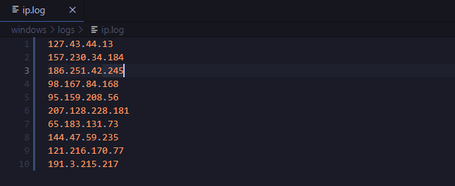

# IPGEN — IP adress generator

## Description
This program generates **fake IP adresses**, that can be stored in a file, or just be printed in the **command line**.
Use the best option for your operative system, **Windows or Unix**.

## Usage
```
ipgen [num] [-s]
```

`[num]`: number of IPs that you want to generate.

`[-s]`: Use this flag only if you want to store the generated IP addresses in a file. The resulting
adresses are stored inside `'logs/ip.log'`.

### Resulting log:



If you want to **clear** the IP log, you can run the following command:
```
ipgen clear
```